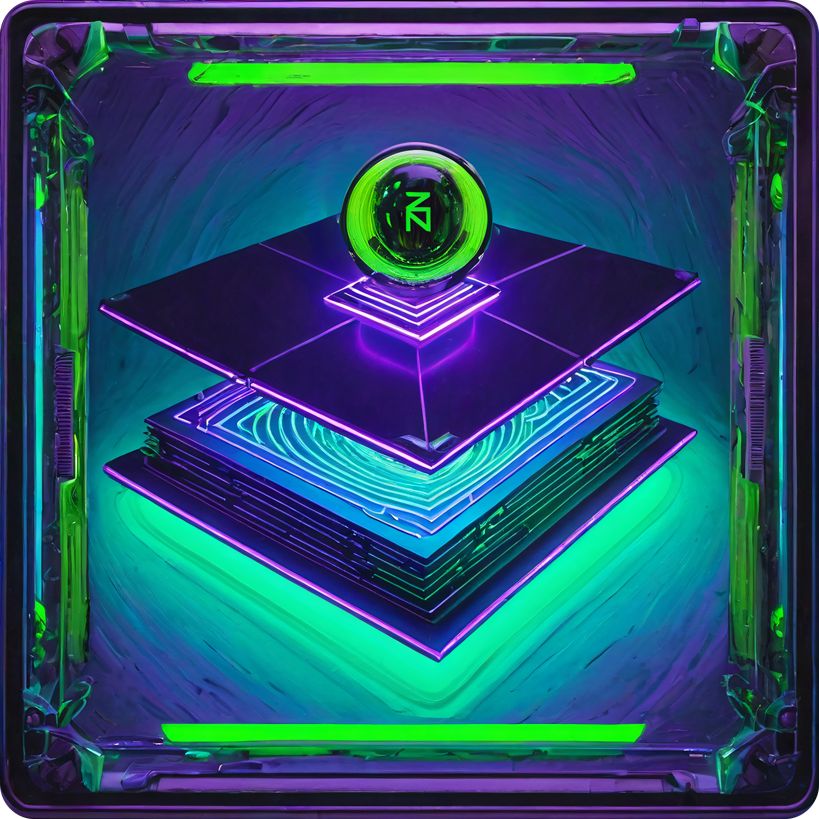

  
  <h1>Z-INDEX: A Zenonian HyperArchive</h1>

Welcome to the Z-INDEX, a meticulously curated Zenonian HyperArchive. This repository serves as a comprehensive hub, aggregating a list of invaluable resources and shared content within the Zenon Network ecosystem.
  
Built by aliens.

## GitHub

- [Zenon Network](https://github.com/zenon-network)
  #### SDKs
  - [Dart](https://github.com/zenon-network/znn_sdk_dart)
  - [Go](https://github.com/MoonBaZZe/znn-sdk-go)
  - [Go](https://github.com/ignition-pillar/go-zdk)
  - [JavaScript](https://github.com/alien-valley/znn.js)
  - [TypeScript](https://github.com/DexterLabZ/znn.ts)
  - [Python](https://github.com/millerships/pyznn)
  - [C#](https://github.com/hypercore-one/znn_sdk_csharp)
  - [PHP](https://github.com/digitalSloth/znn-php)
  - [Java](https://github.com/KingGorrin/znn_sdk_jav)
  - [Kotlin](https://github.com/ItsChaceD/zenon-android)
  #### Wallets
  - [s y r i u s](https://github.com/zenon-network/syrius/)
  - [s y r i u s chrome extension](https://github.com/DexterLabZ/syrius-extension)
  - [Cano](https://github.com/Cano-Wallet/app)
  - [zenon browser wallet](https://github.com/znnpd/zenonbrowserwallet)
  #### Bridge
  - [Bridge Frontend](https://github.com/DexterLabZ/bridge-dapp)
  #### Utilities
  - [Sentrify](https://github.com/MoonBaZZe/sentrify)
  - [Zenon Testnet Stresstest](https://github.com/znnpd/znn-testnet-stresstest)
  - [ZNN Node Parser](https://github.com/sol-znn/znn-node-parser)
  - [Zenon PoCs](https://github.com/sol-znn/Zenon-PoCs)
  - [Zenon Vanity Address Generator](https://github.com/sol-znn/znn-address-generator)
  - [Zenon Reverse Proxy](https://github.com/dumeriz/zenon-repro)
  - [znndNode Docker](https://github.com/0x3639/znndNode)
  - [WalletConnect Demo](https://github.com/uluCthulhu/wallet-connect-demo)
  - [HTLC Demo](https://github.com/Big-Inches-Club-House/htlc-demo)
  - [Zenon Snapshot](https://github.com/znnrigel/zenon_snapshot)
  - [Zenon Raffle](https://github.com/znnrigel/zenon_raffle)
  - [PlasmaPoints Bot](https://github.com/znnrigel/plasmapointsbot)
  #### Research & Development
  - [Dynamic Plasma Ideas](https://github.com/vilkris4/dynamic-plasma-ideas)
  - [EXPERIMENTAL: Pillar Sentry Architecture](https://github.com/sultanofstaking/EXPERIMENTAL-Zenon-Pillar-Sentry-Architecture-For-Running-Pillars)
  - [Zenon Decks](https://github.com/Shazzamazzash/Zenon-Decks)
  - [Awesome Zenon Network](https://github.com/oxmah/awesomezenonnetwork)
  #### Organizations
  - [{H}yperCore One](https://github.com/hypercore-one)
  - [HyperCore Team](https://github.com/HyperCore-Team)
  - [ZenonOrg](https://github.com/ZenonOrg)
  - [Zenon Tools](https://github.com/zenon-tools)
  - [Zenon Hub](https://github.com/zenonhub-io)
  - [Ignition Pillar](https://github.com/ignition-pillar)
  - [Alien Valley](https://github.com/alien-valley)
  - [Alien Trap Society](https://github.com/atsocy)

  
## Websites

### General Websites
- [Zenon Network](https://zenon.network) `zenon.network`
- [Zenon AlphaNet Wiki](https://wiki.zenon.network/#!index.md) `wiki.zenon.network`
- [ZenonOrg](https://zenon.org) `zenon.org`
- [Zenon Wiki](https://ask.zenon.wiki) `ask.zenon.wiki`
- [Zenon Portal](https://zenonportal.xyz) `zenonportal.xyz`

### Explorers
- [Zenon Hub](https://zenonhub.io) `zenonhub.io`
- [Zenon Network](https://explorer.zenon.network) `explorer.zenon.network`
- [ZenonOrg](https://explorer.zenon.org) `explorer.zenon.org`
- [Zenon Tools](https://zenon.tools) `zenon.tools`
- [Zenon Info](https://explorer.zenon.info) `explorer.zenon.info`

### Bridges
- [Zenon Network](https://bridge.zenon.network) `bridge.zenon.network`
- [Zenon Community](https://bridge.mainnet.zenon.community) `bridge.zenon.community`
  #### Status
  - [Bridge Orchestrators Status](https://status.bridge.zenon.community) `status.bridge.zenon.community`
  #### Testnet
  - [Zenon Community](https://bridge.testnet.zenon.community) `bridge.testnet.zenon.community`
  #### Affiliate Program
  - [NoM Affiliate Link Generator](https://affiliate.zenon.community) `affiliate.zenon.community`
  #### Audit
  - [Bridge audit by ChainSafe](https://www.zenon.info/content/files/2023/05/zenon-05-2023-bridge-audit.pdf)

### APIs
  - [ZNN Playground](http://znnplayground.com/) `znnplayground.com`
  - [ZenonHub API Playground](https://zenonhub.io/tools/api-playground) `zenonhub.io/tools/api-playground`

### Forums
- [ZenonOrg](https://forum.zenon.org) `forum.zenon.org`
- [{H}yperCore One](https://forum.hypercore.one) `forum.hypercore.one`

### News
- [Zenon Info](https://zenon.info) `zenon.info`
- [Alien Trap Society](https://atsocy.com) `atsocy.com`

### Rewards
- [Zenon Tools](https://zenon.tools) `zenon.tools`

### Miscellaneous
- [Zenon Fun](https://www.zenon.fun) `zenon.fun`
- [Zenon Friends & Family](https://znn.so) `znn.so`

## Designs
  ### Figma
  - [s y r i u s mobile](https://www.figma.com/file/BmmfUT2DOiLzweeMfcLCse/App?type=design&node-id=0-1&mode=design) `@DrBlaze21`
  - [s y r i u s web extension](https://www.figma.com/file/UvTkW8Gb1wxra4ZdMMvYUk/S-Y-R-I-U-S--Extension-Wallet?type=design&node-id=0-1&mode=design) `@znnayiid`

## Whitepapers
- [Lightpaper](https://www.atsocy.com/assets/blog/whitepapers/lightpaper.pdf)
- [Whitepaper](https://www.atsocy.com/assets/blog/whitepapers/whitepaper.pdf)

## Articles
- [How NOT To Fracture A Layer 1 Chain!](https://hackernoon.com/how-not-to-fracture-a-layer-1-chain-qgi530g3)
- [Zenon Network Aims To Be Satoshi's Ethereum: STEX Bullish on Aliens](https://hackernoon.com/zenon-network-aims-to-be-satoshis-ethereum-stex-bullish-on-aliens)
- [The Orbital Program: Protocol Level Liquidity explained](https://medium.com/@znndao/the-orbital-program-protocol-level-liquidity-explained-86dc5ce7af65)
- [A Blockchain Based Multi-User Roguelike.](https://dooplejoy.medium.com/a-blockchain-based-multi-user-roguelike-game-e45eaf232830)
### Medium
- [Zenon Network | All-in-one Starters Guide](https://medium.com/@znnoutlawz/zenon-network-all-in-one-starters-guide-1ba37b29d12e)
- [The Zenon Enigma](https://medium.com/@shaimo/the-zenon-enigma-782f8b293bd6)
- [ZNN Aliens Club — 3D printed high-tech NFTs](https://medium.com/@dr.greenthumb421/znn-aliens-club-3d-printed-high-tech-nfts-cd4e6da77648)
- [Introducing StarLight](https://starlightl.medium.com/introducing-starlight-d11d8208b8b)
- [Initial commit](https://medium.com/@ZenDAO/initial-commit-94f548dc013c)
- [Z_ONUM](https://medium.com/@z_onum/z-onum-c5914e72ff85)
- [Zenon Network Guide — All you need to know — part 1](https://lazyprius.medium.com/zenon-network-guide-all-you-need-to-know-part-1-f6aa2f18f3d4)
- [Zenon Network | Raspberry Pi Node Guide](https://medium.com/@jer0n/zenon-network-raspberry-pi-node-guide-1cd02d69e52e)
  #### Zenon Network `@zenon.network`
  - [Towards NoM Phase 1 — Global Scale, Global Adoption!](https://medium.com/@zenon.network/towards-nom-phase-1-global-scale-global-adoption-9046ec78218d)
  - [The New NFT Standard: when cryptography meets steganography](https://medium.com/@zenon.network/the-new-nft-standard-when-cryptography-meets-steganography-9e356007dcaa)
  - [Hyperspace x Accelerator-Z: towards a DAO of DAOs](https://medium.com/@zenon.network/hyperspace-x-accelerator-z-towards-a-dao-of-daos-38dfad496365)
  - [Mission 2022 — Network of Momentum — Atomic Era Roadmap](https://medium.com/@zenon.network/mission-2022-network-of-momentum-atomic-era-roadmap-f0208898e058)
  - [Wrapped ZNN (wZNN) Liquidity Program — Alphanet Edition](https://medium.com/@zenon.network/wrapped-znn-wznn-liquidity-program-alphanet-edition-e05d7cae7b81)
  - [ZNN & QSR rewards specifications : Alphanet update](https://medium.com/@zenon.network/znn-qsr-rewards-specifications-alphanet-update-338eac03581e)
  - [Full Node Invasion — Network of Momentum Phase 0](https://medium.com/@zenon.network/full-node-invasion-network-of-momentum-phase-0-ba5aaf99fa5e)
  - [Orbital Program — Protocol Level Liquidity](https://medium.com/@zenon.network/orbital-program-protocol-level-liquidity-2f9567830105)
  - [Network of Momentum — The decentralized self-evolving superorganism](https://medium.com/@zenon.network/network-of-momentum-the-decentralized-self-evolving-superorganism-fad1de21868)
  - [Zenon Fabric — Paving the way for mass-scale adoption](https://medium.com/@zenon.network/zenon-fabric-paving-the-way-for-mass-scale-adoption-12f0ecd5411a)
  - [Plasma: the new fee paradigm for the next-gen decentralized network](https://medium.com/@zenon.network/plasma-the-new-fee-paradigm-for-the-next-gen-decentralized-network-4ec3f27e4a6b)
  - [WarpDrive — The pre-Alphanet Zenon Hackathon](https://medium.com/@zenon.network/warpdrive-the-pre-alphanet-zenon-hackathon-adc668a2a1fc)
  - [Zenon — Community generated AMA Alphanet edition](https://medium.com/@zenon.network/zenon-community-generated-ama-alphanet-edition-d89941e3906d)
  - [SwapDrop Event — October 1st](https://medium.com/@zenon.network/swapdrop-event-october-1st-bd99964589aa)
  - [Wrapped ZNN (wZNN) Liquidity Program](https://medium.com/@zenon.network/wrapped-znn-wznn-liquidity-program-2b50fd0e4758)
  - [Zenon. Building bridges. 2-way BSC Bridge](https://medium.com/@zenon.network/zenon-building-bridges-272538cde1a7)
  - [Zenon Public Incentivized Testnet Overview](https://medium.com/@zenon.network/zenon-public-incentivized-testnet-overview-591db5fc9bc9)
  - [The next chapter: Network of Momentum Phase 0 Decentralized Transition Mechanism](https://medium.com/@zenon.network/the-next-chapter-network-of-momentum-phase-0-decentralized-transition-mechanism-7d01ae701d61)
  - [Alphanet Swap Cycles](https://medium.com/@zenon.network/alphanet-swap-cycles-658981a9d8bd)
  - [Use-case dilemma](https://medium.com/@zenon.network/use-case-dilemma-40516b20e6ef)
  - [Zenon — Community generated AMA edition 2](https://medium.com/@zenon.network/zenon-community-generated-ama-edition-2-1ef42e624a90)
  - [Building bridges](https://medium.com/@zenon.network/building-bridges-4ed4eb6988a)
  - [Paving the way](https://medium.com/@zenon.network/paving-the-way-1332f61a66b2)
  - [ZNN x QSR Alphanet specifications](https://medium.com/@zenon.network/znn-x-qsr-alphanet-specifications-83d27c005c09)
  - [Zenon Fabric. - Paving the way to future alliances.](https://medium.com/@zenon.network/zenon-fabric-f6fbe908e63f)
  - [Zenon — Community generated AMA](https://medium.com/@zenon.network/zenon-community-generated-ama-e0a1e8499379)
  - [Project Quasar](https://medium.com/@zenon.network/project-quasar-88c3ddf850c3)
  - [Zenon Project Incubator - Intro to Byzantium Operations.](https://medium.com/@zenon.network/zenon-project-incubator-1bbb221e1d2b)
  - [III. When machines come to an agreement: The endeavor for the ultimate decentralized consensus](https://medium.com/@zenon.network/iii-when-machines-come-to-an-agreement-the-endeavor-for-the-ultimate-decentralized-consensus-98da3bc5254a)
  - [When machines come to an agreement: Evolution of classical consensus.](https://medium.com/@zenon.network/when-machines-come-to-an-agreement-evolution-of-classical-consensus-a919d6ac8080)
  - [Awareness Initiative, the final chapter.](https://medium.com/@zenon.network/awareness-initiative-the-final-chapter-7fd187ca2cb)
  - [When machines come to an agreement: Evolution of classical consensus.](https://medium.com/@zenon.network/when-machines-come-to-an-agreement-evolution-of-classical-consensus-3dc577fbd1bc)
  - [When machines come to an agreement](https://medium.com/@zenon.network/when-machines-come-to-an-agreement-52c4ae8cf1a1)
  - [Pillars Lock-in phase](https://medium.com/@zenon.network/pillar-lock-in-phase-de5b7d89b130)
  - [Community update May 2nd](https://medium.com/@zenon.network/community-update-may-2nd-a1c62b3c784)
  - [Intro](https://medium.com/@zenon.network/intro-6b3c9e4e6900)
  #### Zyler `@Zyler9985`
  - [Zenon’s Synergy With Nostr](https://medium.com/@Zyler9985/zenons-synergy-with-nostr-c36fe2bf955c)
  - [Why Zenon Is Regulation-Proof](https://medium.com/@Zyler9985/why-zenon-is-regulation-proof-b696c3a03d0d)
  - [Zenon Network: Merged Mining Bitcoin](https://medium.com/@Zyler9985/zenon-network-merged-mining-bitcoin-fb7ccf60161e)
  - [Zenon Network: A Blistering Need For Speed](https://medium.com/@Zyler9985/zenon-network-a-blistering-need-for-speed-ce34246c2f01)
  - [Zenon Network: Alien Plans For Bitcoin](https://medium.com/@Zyler9985/zenon-network-viii-alien-plans-for-bitcoin-804e1ba60a3c)
  - [Zenon Network VII: 8 Exciting Things Coming To Zenon](https://medium.com/@Zyler9985/zenon-network-vii-8-exciting-things-coming-to-zenon-ab09b59ac48d)
  - [Longer Version: How to buy $ZNN and store it in the SYRIUS Wallet](https://medium.com/@Zyler9985/longer-version-how-to-buy-znn-and-store-it-in-the-syrius-wallet-e197233ccb24)
  - [Zenon Network VI: Welcome To The Multiverse](https://medium.com/@Zyler9985/zenon-network-vi-welcome-to-the-multiverse-a7c1cbedc94c)
  - [Zenon Network V: 8 Tips For Delegators](https://medium.com/@Zyler9985/zenon-network-v-8-tips-for-delegators-e0fb031d3f4b)
  - [Zenon Network IV: All Hail The Zenocracy!](https://medium.com/@Zyler9985/zenon-network-iv-all-hail-the-zenocracy-f785203d102b)
  - [Zenon Network: Game-Theory For Progressive Decentralisation](https://medium.com/@Zyler9985/zenon-network-iii-game-theory-for-progressive-decentralisation-38f94457b03e)
  - [Zenon Network II: Press Start 2P](https://medium.com/@Zyler9985/zenon-network-ii-press-start-2p-47847aa68645)
  - [Zenon Network I: The Green Pill](https://medium.com/@Zyler9985/zenon-network-i-the-green-pill-883e608727a)
  - [Zenon Network: How to buy $ZNN and store it in the SYRIUS Wallet](https://medium.com/@Zyler9985/zenon-network-how-to-buy-znn-and-store-it-in-the-syrius-wallet-65a8f3ced4db)
  - [Zenon Network: Press Start 2P](https://medium.com/@Zyler9985/zenon-network-press-start-2p-423ad84695bd)
  - [Zenon Network: Alien Plans For Bitcoin](https://medium.com/@Zyler9985/zenon-network-alien-plans-for-bitcoin-draft-for-feedback-3bc7e4ac2f84)
  - [Zenon Network: Building Bridges](https://medium.com/@Zyler9985/zenon-network-building-bridges-draft-article-for-feedback-4bb2ef8af7eb)
  - [The Zenon Ethos](https://medium.com/@Zyler9985/the-zenon-ethos-4e0ab0dff12b)
  - [Zenon Network: Strategy Guide For Rewards](https://medium.com/@Zyler9985/zenon-network-strategy-guide-for-rewards-1df807587898)
  - [Zenon’s Anti-FUD Shield](https://medium.com/@Zyler9985/zenons-anti-fud-shield-aaa53210eba9)
  - [Zenon Network: 8 Tips For Delegators](https://medium.com/@Zyler9985/zenon-network-8-tips-for-delegators-a45d223b5eb5)
  - [Zenon Network: Game-Theory For Progressive Decentralisation](https://medium.com/@Zyler9985/zenon-network-game-theory-for-progressive-decentralisation-97dd65b417a9)
  - [Zenon Network: A Zenocracy in Peril](https://medium.com/@Zyler9985/zenon-network-a-zenocracy-in-peril-a9566991b455)
  - [Zenon Network: An Introduction to Governance](https://medium.com/@Zyler9985/zenon-network-an-introduction-to-governance-953aec64fda)
  - [Zenon Network: FAQs for Beginners](https://medium.com/@Zyler9985/zenon-network-faqs-for-beginners-d0df6d8d7476)
  - [Zenon Network: A Noir Story](https://medium.com/@Zyler9985/zenon-network-a-noir-story-a06cc8945439)
  - [An Alien’s Thesis For Zenon Network](https://medium.com/@Zyler9985/an-aliens-thesis-for-zenon-network-97f46c49a13a)
  - [The Power of NFTs on Zenon](https://medium.com/@Zyler9985/the-power-of-nfts-on-zenon-c1c777c76106)
  - [Zenon Network: How to apply for a funding grant](https://medium.com/@Zyler9985/zenon-network-how-to-apply-for-a-funding-grant-e977b7efce0d)
  - [Zenon Forum: NoM 101](https://medium.com/@Zyler9985/zenon-forum-nom-101-569e0dac4f8a)
  - [Putting the ‘Z’ in Decentralization](https://medium.com/@Zyler9985/putting-the-z-in-decentralization-7f40b33c87fc)
  - [Simple Guideline for AZ Proposals](https://medium.com/@Zyler9985/simple-guideline-for-az-proposals-94621c80f257)
  - [Zyler Proposal: The Phased Plan](https://medium.com/@Zyler9985/zyler-proposal-the-phased-plan-4ec5fac82ae8)
  - [How Zenon Mirrors The Bitcoin Ethos](https://medium.com/@Zyler9985/how-zenon-mirrors-the-bitcoin-ethos-142300e59e64)
  - [A concise overview of Zenon](https://medium.com/@Zyler9985/a-concise-overview-of-zenon-aa72ba4dfffd)
  - [Zyler Proposal 1: A Series of Articles](https://medium.com/@Zyler9985/zyler-proposal-1-a-series-of-articles-f105b698fedf)
  - [How to buy $ZNN using pancakeswap](https://medium.com/@Zyler9985/how-to-buy-znn-using-pancakeswap-ece02adbe80a)
  - [Forget web3, it’s time for Zenon](https://medium.com/@Zyler9985/forget-web3-its-time-for-zenon-b7fedbf2ae2f)
  - [Hello, this is Zenon](https://medium.com/@Zyler9985/hello-this-is-zenon-9adbdb39ef6c)
  #### Vilkris `@vilkris`
  - [P2P Swap Tutorial - How to conduct P2P Swaps on Zenon Network with Syrius wallet](https://medium.com/@vilkris/p2p-swap-tutorial-3805f10d2d21)
  - [Key points for Warp Drive](https://medium.com/@vilkris/key-points-for-warp-drive-27737de768f4)
  - [zenon.tools - Simple tools for Network of Momentum participants](https://medium.com/@vilkris/zenon-tools-146edcbac0d6)
  #### Shazz `@shazzamazzash`
  - [Zenon.Network — An ape’s guide to the galaxy redux](https://shazzamazzash.medium.com/zenon-network-an-apes-guide-to-the-galaxy-7aad7dacdfef)
  - [The Zenon Deck](https://shazzamazzash.medium.com/the-zenon-deck-b78a8d3c2041)
  - [Zenon Network Liquidity Mining - Protocol level liquidity rewards for DeFi yield chasers](https://shazzamazzash.medium.com/zenon-network-liquidity-mining-d16a1fb2b6e6)
  - [An Ape’s guide to run a full node for Zenon on Windows 10.](https://shazzamazzash.medium.com/an-apes-guide-to-run-a-full-node-for-zenon-on-windows-10-910adc2cf8ea)
  - [Fundamental Analysis of Zenon.Network (inspired by Charlie Munger’s investment principles)](https://shazzamazzash.medium.com/fundamental-analysis-of-zenon-network-based-on-charlie-mungers-investment-principles-9097db0fa1bd)
  #### George `@georgezgeorgez`
  - [Web3 is dead. Long live Accelerator-Z.](https://medium.com/@georgezgeorgez/web3-is-dead-long-live-accelerator-z-73daca4d0d04)
  - [A Message to Humans: An Alien’s Guide to Lightning Network Watchtower Limitations and Beyond](https://medium.com/@georgezgeorgez/a-message-to-humans-an-aliens-guide-to-lightning-network-watchtower-limitations-and-beyond-96138967fa9b)
  #### John-Z `@john_84734`
  - [Zenon Social Analysis](https://medium.com/@john_84734/zenon-social-analysis-5c49d8a6fe53)
  - [PR & Banner ads for NoM](https://medium.com/@john_84734/pr-banner-ads-for-nom-c343b46d8ee5)
  - [Zenon listing on Mercatox](https://medium.com/@john_84734/zenon-listing-on-mercatox-e0eca27a2966)
  #### Moonpapers `@moonpapers`
  - [Why governance in most crypto project sucks and how to fix it](https://moonpapers.medium.com/why-governance-in-most-crypto-project-sucks-and-how-to-fix-it-3cfb7bd492c8)
  - [Zenon Network & the Bad Seeds](https://moonpapers.medium.com/zenon-network-and-the-bad-seeds-d87c01fe9abe)
  #### TheAliensKnow Academy `@TheAliensKnow_Academy`
  - [Start building](https://medium.com/@TheAliensKnow_Academy/start-building-5e65a79b3747)
  - [TheAliensKnow Academy](https://medium.com/@TheAliensKnow_Academy/thealiensknow-academy-216a98f567d4)
  #### Learn Zenon `@learnzenon`
  - [Bi-Weekly Community Recap #2 (15th-31th July): Zenon Network](https://medium.com/@learnzenon/bi-weekly-community-recap-2-15th-31th-july-zenon-network-940f5f9f4938)
  - [Bi-Weekly Community Recap #1 (1st-15th July): Zenon Network](https://medium.com/@learnzenon/bi-weekly-community-recap-1-1st-15th-july-zenon-network-9cad261a5a7e)

### Zenon Info
- [Zenon Network vs Kaspa](https://www.zenon.info/compare-zenon-network-with-kaspa/)
- [Narwhal and Tusk on Zenon Network](https://www.zenon.info/narwhal-and-tusk-on-zenon-network/)
- [If Zenon Network Was a Video Game...](https://www.zenon.info/if-zenon-network-was-a-video-game/)
- [ChainSafe Zenon Network Bridge Audit](https://www.zenon.info/chainsafe-zenon-network-bridge-audit/)
- [AZ for ChainSafe Audit](https://www.zenon.info/az-for-chainsafe-audit/)
- [Liquidity Bootstrap & Provisioning Campaign](https://www.zenon.info/liquidity-bootstrap-provisioning-campaign/)
- [Atomic Swaps are coming to Zenon Network](https://www.zenon.info/atomic-swaps-coming-to-zenon-network/)
- [How to Setup a Node for Zenon Network](https://www.zenon.info/how-to-setup-a-node-for-zenon-network/)
- [The Lone Aliens Ordinal Project](https://www.zenon.info/lone-aliens/)
- [What is a Meta-DAG?](https://www.zenon.info/what-is-a-meta-dag/)
- [What is Zenon Network?](https://www.zenon.info/what-is-zenon-network/)
- [Zenon Network Trustless Bridge AMA](https://www.zenon.info/zenon-network-trustless-bridge-ama/)
- [Some Cold Hard Feedback about Zenon Network](https://www.zenon.info/some-cold-hard-feedback/)
- [Zenon Network: Strategy Guide For Rewards](https://www.zenon.info/zenon-network-rewards-strategy-guide/)
- [Zenon Network is Building](https://www.zenon.info/zenon-network-is-building/)
- [Networks that Implement a Heavy VM at L1 will always be Plagued by Scalability Issues](https://www.zenon.info/networks-that-implement-a-heavy-vm-at-l1-will-always-be-plagued-by-scalability-issues-in-the-long-run/)
- [Zenon Network: Game-Theory For Progressive Decentralisation](https://www.zenon.info/zenon-network-game-theory-for-progressive-decentralisation/)
- [How Zenon Mirrors The Bitcoin Ethos](https://www.zenon.info/how-zenon-mirrors-the-bitcoin-ethos/)
- [Zenon Network: A Noir Story](https://www.zenon.info/zenon-network-a-noir-story/)
- [Zenon Network: An Introduction to Governance](https://www.zenon.info/zenon-network-an-introduction-to-governance/)
- [Zenon Network: 8 Tips For Delegators](https://www.zenon.info/8-tips-for-delegators/)
- [wen sentinels?](https://www.zenon.info/wen-sentinels/)
- [wen zenon network article?](https://www.zenon.info/wen-zenon-network-article/) 
  #### Development Updates
  - [Zenon Network Community Update | December 2023](https://www.zenon.info/zenon-network-community-update-december-2023/)
  - [Zenon Network Community Update | August 2023](https://www.zenon.info/zenon-network-community-update-august-2023/)
  - [Zenon Network Community Update | May thru July 2023](https://www.zenon.info/zenon-network-community-update-may-july-2023/)
  - [Zenon Network April 2023 Community Update](https://www.zenon.info/zenon-network-april-2023-community-update/)
  - [Zenon Network March 2023 Community Update](https://www.zenon.info/zenon-network-march-2023-community-update/)
  - [Zenon Network February 2023 Community Update](https://www.zenon.info/zenon-network-february-2023-community-update/)
  - [Zenon Network January 2023 Community Update](https://www.zenon.info/zenon-network-january-2023-update/) 

## Internet Archive (Wayback Machine)
- [Zenon Network v1 (April 11, 2019)](https://web.archive.org/web/20190411124750/https://zenon.network/) `zenon.network`
- [Zenon Network v2 (May 28, 2020)](https://web.archive.org/web/20200528090317/https://zenon.network/) `zenon.network`
- [Zenon Guide](https://web.archive.org/web/20220901151327/https://zenon-guide.space/) `zenon-guide.space`

## Contributing

## License

